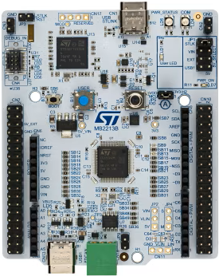
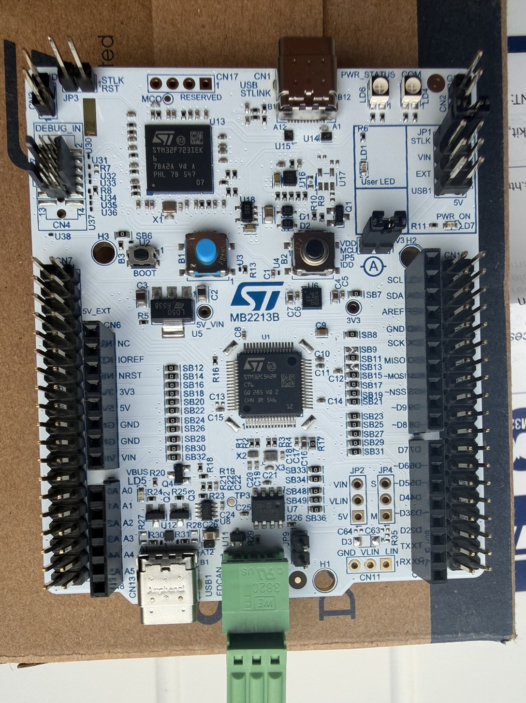
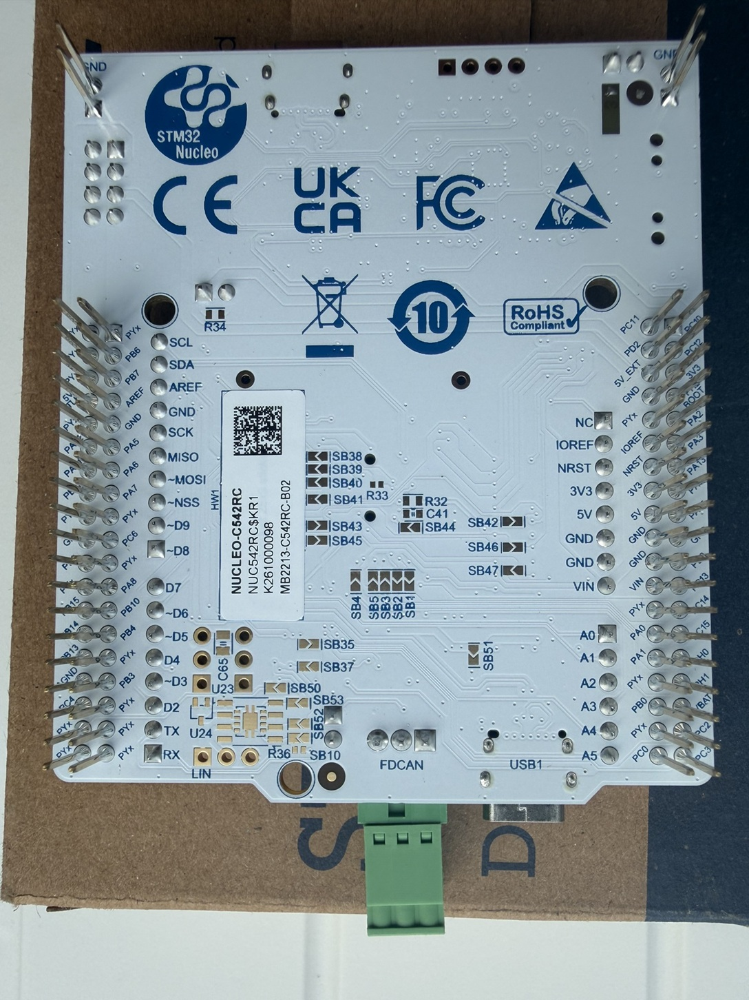

# board_t1 — NUCLEO-C542RC

Bare-metal firmware for the **ST NUCLEO-C542RC** (STM32C542RCT6).



## Hardware

- **MCU:** STM32C542RCT6 — Arm **Cortex-M33** @ **144 MHz**, 256 KB flash, RAM in-package
- **Board:** NUCLEO-C542RC, on-board ST-Link (V3) debug probe + Virtual COM Port
- **Debug/flash:** STM32CubeProgrammer (`SWD`), ST-Link VCP **COM73** (may change)
- **Console:** USART2 (PA2=TX, PA3=RX) @ **115200** 8N1 → ST-Link VCP





## Projects

All projects build with CMake + Ninja and support the same two presets:
`release_GCC` (Arm GCC) and `release_ARMCLANG` (ST LLVM `starm-clang`).

| Project | Purpose | Result @ 144 MHz |
|---------|---------|------------------|
| [`board_t1_cmake`](board_t1_cmake/) | Baseline — holds the generated/peripheral infrastructure (CMSIS, DFP, HAL/LL, board init). Toggles LD1, prints the system clock. | `SystemCoreClock = 144000000 Hz` every 5 s |
| [`coremark_144m`](coremark_144m/) | EEMBC **CoreMark 1.0** benchmark. | GCC **435.3** / ST LLVM **428.4** |
| [`dhry_144m`](dhry_144m/) | **Dhrystone 2.1** benchmark. | GCC **1.459** / ST LLVM **1.559** DMIPS/MHz |

The baseline (`board_t1_cmake`) is the **source of truth** for the generated device code:
CMSIS packs, the STM32C5 DFP, HAL/LL drivers and the board init (`generated/hal`,
`user_modifiable`). The two benchmark projects are independent top-level projects that
**reference that infrastructure via relative paths** (`../board_t1_cmake`) rather than
copying it.

The hardware source of truth is [`board_t1.ioc2`](board_t1.ioc2); regenerating it with
CMSIS-Toolbox / STM32CubeMX2 reproduces `board_t1_cmake`.

## Build, flash, capture

Each project pins its tool paths via `bootstrap.ps1`:

```bat
powershell -NoProfile -ExecutionPolicy Bypass -File bootstrap.ps1   :: once, from the project folder
cmake --preset release_GCC_NUCLEO-C542RC                            :: or release_ARMCLANG_...
cd build\release_GCC_NUCLEO-C542RC
ninja                  :: build the ELF
ninja hex              :: Intel HEX
ninja flash            :: program the MCU (STM32CubeProgrammer, SWD, under reset, verify, reset)
ninja capture          :: live-capture the UART output from the ST-Link VCP (COM port auto-detected)
```

Each preset uses a separate build directory, so they can coexist:
`build\release_GCC_NUCLEO-C542RC`, `build\release_ARMCLANG_NUCLEO-C542RC`.

> Use CMake >= 3.21 (e.g. the STM32CubeIDE-bundled CMake); the system `cmake` 3.20.5
> cannot read `CMakePresets.json` v3.

See the per-project `README.md` files for their individual behaviour.